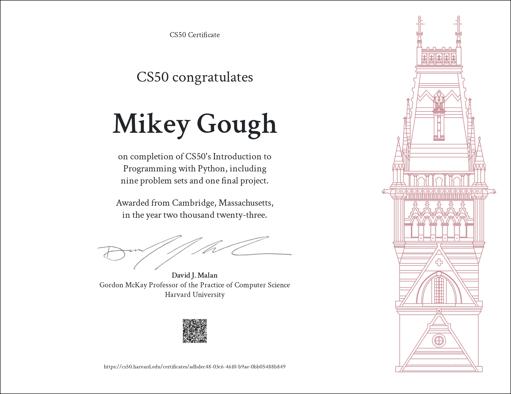

# cs50p
Harvard CS50P: Introduction to Programming with Python

#### [CS50P](https://bit.ly/3VOYzpd)

an introductory python programming course that teaches students how to read and write code as well as how to test and "debug" it. ten weeks with weekly lectures and problem sets with a [final project](https://github.com/mikeygough/tradingbuddy).

<ul>
  <li>Functions, Variables</li>
  <li>Conditionals</li>
  <li>Loops</li>
  <li>Exceptions</li>
  <li>Libraries</li>
  <li>Unit Tests</li>
  <li>Regular Expressions</li>
  <li>Object-Oriented Programming</li>
</ul>

